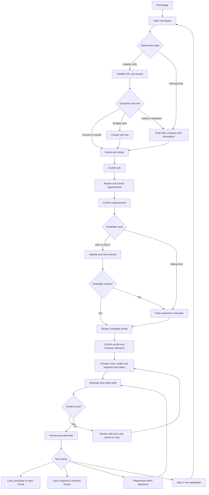
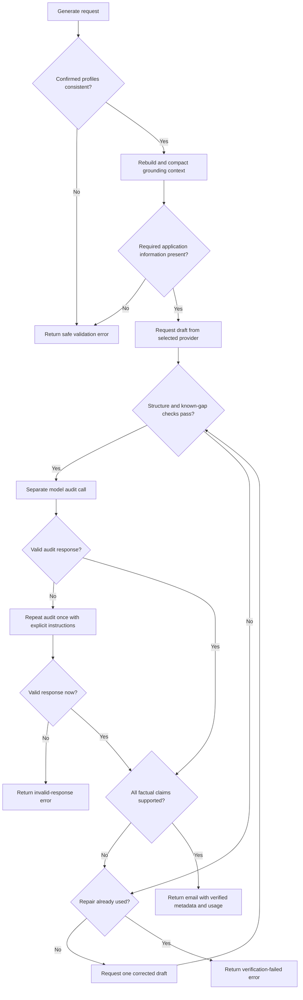
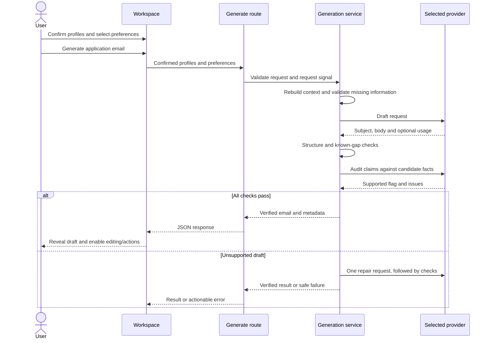
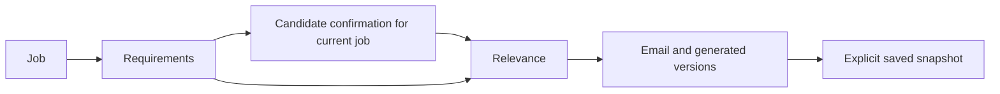

# App Flow Document

**Project:** HireDraft

**Baseline:** Current implementation, 3 October 2026

## 1. Pages and entry points

| Route          | Purpose                                                                    |
| -------------- | -------------------------------------------------------------------------- |
| `/`            | Product introduction, example emails, workflow, supported sources and FAQ. |
| `/analyze-job` | Four-step application workspace and saved email history.                   |
| `/about`       | Product explanation.                                                       |
| `/contact`     | Support guidance and optional configured contact address.                  |
| `/privacy`     | Data-handling explanation.                                                 |
| `/terms`       | Terms of use.                                                              |
| Unknown route  | 404 with a route back to the site.                                         |

Shared public navigation becomes a mobile menu on smaller screens. The workspace uses a horizontal step navigation on smaller screens and a sidebar on desktop. Theme changes persist across pages without clearing current form values.

## 2. Main user journey

## 3. Four-step behavior

### Step 1: The opportunity

1. Paste a supported public LinkedIn job/hiring-post URL or select manual entry.
2. Extraction checks the URL and obtains available public content. Login walls, blocked requests, expired links and incomplete content can prevent full extraction.
3. If several roles are detected, select a role before proceeding.
4. Review and correct job title, company and description, plus available recruiter/application fields.
5. Confirm the selected job. Requirements are derived locally from that confirmed input.

The application does not silently treat an inaccessible page as a complete job. Manually entered details follow the same review and confirmation path.

### Step 2: The requirements

Review technical skills, responsibilities/professional requirements, employment expectations and application instructions. Correct extracted items and inspect source evidence where provided. Confirmation unlocks candidate preparation. Requirements describe the role; they do not become candidate experience.

### Step 3: Your experience

Upload a PDF/DOCX smaller than 5 MiB, drag a file into the upload control, or enter experience manually. Reading extracts text on the server; candidate parsing and review run locally. Review identity, employment, projects, skills, education, certifications and achievements. Optional context and a previous application email can guide writing.

Confirming the candidate profile also computes and confirms relevance against current requirements. There is no separate matching screen. Work duration does not prove tool-specific tenure, and internship/project evidence must retain its category.

### Step 4: Your introduction

Byanara AI is initially selected. The provider list marks missing credentials as unavailable; generation requires an available selection. Choose Professional, Concise or Confident tone and Standard or Short length. Supply any requested application information missing from the confirmed profiles.

The draft is checked before display. Subject and body appear with a typing effect, or immediately when reduced motion is enabled. Action controls become available after the reveal. Review the email before using it; subsequent manual edits have not been audited automatically.

## 4. Draft verification flow

“Separate audit” means a separate request to the selected provider, not a different vendor or a human certification. Provider failure, timeout and cancellation can stop this flow at any network call.

## 5. Generation sequence

## 6. Dependencies and invalidation

| User action                       | State behavior                                                                                      |
| --------------------------------- | --------------------------------------------------------------------------------------------------- |
| Edit job input or selected role   | Invalidate confirmed downstream results; requirements must be reviewed again.                       |
| Correct requirements              | Invalidate dependent candidate/relevance confirmation and email results.                            |
| Change candidate facts or context | Require profile reconfirmation and invalidate relevance/email results.                              |
| Change writing preferences        | Cancel an in-flight generation; existing text requires a new generation to reflect the preferences. |
| Cancel processing                 | Abort supported network work and advance a request version so stale results are ignored.            |
| Edit subject/body                 | Update the current draft and edited status; edits are not automatically reverified.                 |
| Start a new application           | Reset application inputs/results and generation allowance; saved history remains.                   |
| Reload or leave the workspace     | Unsaved React state is lost; explicit saved snapshots and theme remain in browser storage.          |

Invalidating dependent results also clears generated version history and feedback. Reconfirming earlier steps is distinct from starting a new application; the generation allowance is managed by the current application session.

## 7. Revisions, editing and output

The UI allows one successful initial generation and two successful regenerations. Failed generations do not consume the allowance. Feedback can be entered manually or selected through More metrics, Shorter and Stronger opening suggestions. A previous draft is revision context, not factual evidence. Version switching preserves manual edits to generated versions within the session.

The editor offers plain text or Markdown, with Write, Preview and Split modes, formatting controls, undo/redo and counts. Markdown tables and long content remain inside the responsive layout.

| Output                   | User-visible result                                                                      |
| ------------------------ | ---------------------------------------------------------------------------------------- |
| Copy subject/body/email  | Current subject and readable email text go to the clipboard.                             |
| Copy as Markdown / `.md` | Preserve Markdown source.                                                                |
| `.txt`                   | Readable plain-text email.                                                               |
| `.docx`                  | Word document with basic formatting/links; tables become text rows.                      |
| Open in Gmail            | Open a compose window with subject/body; the user adds recipients/attachments and sends. |
| Save to History          | Add a unique snapshot to local history, up to 30 entries.                                |

Saved History supports reopening and deleting snapshots. It is browser-local, is not synchronized across devices, and does not restore the complete confirmed application profiles. The save action captures the current draft, including manual edits.

## 8. Recovery and accessibility

Errors retain useful reviewed inputs whenever possible. Extraction offers manual entry; unreadable resumes offer another file or manual experience; provider errors offer configuration/account guidance or another available selection. History-full and storage failures are surfaced rather than silently reporting a successful save.

Keyboard operation, visible focus, labeled fields, status announcements, menu dismissal, FAQ tab navigation and reduced-motion behavior are covered in browser tests. See [TESTING.md](TESTING.md) for the review matrix and [TRD.md](TRD.md) for exact server boundaries.
