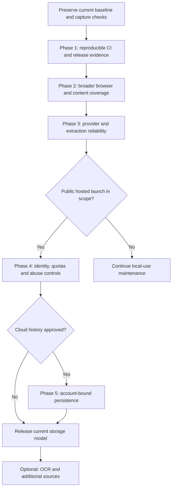
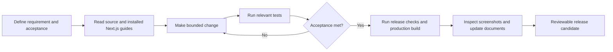

# Implementation Plan

**Project:** HireDraft

**Baseline:** 3 October 2026

**Purpose:** Maintain and extend the existing product with traceable implementation and validation steps.

## 1. Planning basis

The core product is already implemented. This document records the delivered baseline and proposes an ordered backlog; it does not claim the proposed work has been completed or scheduled. The current requirements and journey are described in [TRD.md](TRD.md) and [App_Flow.md](App_Flow.md).

No delivery dates or assigned owners are assumed. Choose scope and assign owners before beginning a new phase. Preserve existing work in the shared repository when making changes.

## 2. Delivered baseline

| Workstream             | Current implementation                                                           | Verification / reference                                                                                                 |
| ---------------------- | -------------------------------------------------------------------------------- | ------------------------------------------------------------------------------------------------------------------------ |
| App foundation         | Next.js App Router pages, local Geist font, shared navigation, light/dark theme  | [app](app), [components/theme-provider.jsx](components/theme-provider.jsx)                                               |
| Opportunity capture    | LinkedIn job/post extraction, multi-role selection and manual fallback           | [src/server/extract-job.js](src/server/extract-job.js), [src/server/extract-post.js](src/server/extract-post.js)         |
| Evidence preparation   | Requirements review, resume worker, candidate corrections and relevance matching | [src](src), [src/server/resume-reader.js](src/server/resume-reader.js)                                                   |
| AI orchestration       | Byanara AI default, alternative providers, compact context, audit and one repair | [src/server/ai-provider.js](src/server/ai-provider.js), [src/server/email-generation.js](src/server/email-generation.js) |
| Draft workspace        | Typing reveal, reduced motion, feedback, generation versions and editing         | [components/workspace.jsx](components/workspace.jsx)                                                                     |
| Output and persistence | Markdown, TXT/DOCX exports, Gmail compose and local saved history                | [src/email-export.js](src/email-export.js), [src/email-history.js](src/email-history.js)                                 |
| Regression coverage    | Domain/API tests, optional Python gateway tests and Chrome E2E coverage          | [tests](tests), [e2e](e2e), [llm-gateway/test_gateway.py](llm-gateway/test_gateway.py)                                   |
| Responsive review      | Production build and 25 browser tests passed; viewport checks from 320–1440px    | [README.md](README.md), [e2e/responsive.spec.js](e2e/responsive.spec.js)                                                 |

## 3. Proposed delivery order

Phase 4 is a prerequisite for a public service exposing costly provider operations. Phases 5 and optional source/OCR extensions are separate product decisions, not required changes to the current local workflow.

## 4. Phase 1 — Reproducible validation and releases

**Status:** Proposed.

1. Add a CI workflow using the supported Node.js version and `npm ci`.
2. Run type checking, domain/API regression tests, secret checks and the production build.
3. Configure the browser runner deliberately: the current Playwright configuration expects installed Google Chrome. Either install that channel in CI or explicitly change the browser strategy.
4. Run E2E tests against the new build with `CI` set, so an unrelated existing server cannot be reused.
5. Upload failing traces and review screenshots as CI artifacts, keeping personal data and credentials out of fixtures.
6. Record the commit, runtime, test results and configuration requirements for each release.

**Acceptance:** A clean checkout produces the same test/build result without local `.env` secrets for fixture-based browser tests. Failures block release and expose useful artifacts.

**Primary files:** New CI configuration, [package.json](package.json), [playwright.config.js](playwright.config.js), [TESTING.md](TESTING.md).

## 5. Phase 2 — Broader interface and evidence coverage

**Status:** Proposed; current Chrome viewport coverage is implemented.

1. Add explicit Firefox/WebKit projects after installing their test dependencies.
2. Verify physical iOS and Android behavior for file upload, native selects, clipboard, downloads and Gmail compose.
3. Extend workflow responsiveness checks to light-theme populated states and expanded saved-history details.
4. Add long job titles, company names, experience entries, missing candidate fields and multilingual text fixtures where the parser can support them.
5. Run targeted accessibility checks for focus order, status messages, field errors, contrast and touch target usability.
6. Fix defects in the responsible component rather than masking document overflow globally.

**Acceptance:** Supported browser/device coverage is documented with evidence. Long-content scenarios remain usable; controls do not overlap or disappear. Existing confirmation, invalidation and export behavior remains intact.

**Primary files:** [e2e](e2e), [components/workspace.jsx](components/workspace.jsx), [components/markdown-editor.jsx](components/markdown-editor.jsx), [app/globals.css](app/globals.css).

## 6. Phase 3 — Integration reliability

**Status:** Proposed.

1. Keep credential presence separate from live health. If adding a health indicator, define its cost, timeout and caching behavior before implementing it.
2. Add opt-in live smoke checks with synthetic job/candidate data for each configured provider.
3. Extend fixtures for restricted/partial LinkedIn pages and safe redirect handling when upstream markup changes.
4. Verify host/proxy origin handling against the intended deployment and preserve safe errors.
5. Measure generation latency, audit failures, repairs and reported usage using redacted telemetry if telemetry is approved.
6. Evaluate provider outages and rate limits without introducing unbounded retries or silent vendor fallback.

**Acceptance:** Timeout/error scenarios preserve recoverable UI state. No upstream credentials or personal payloads appear in public errors/logs. Invalid audits and unsupported claims cannot be returned as verified.

**Primary files:** [src/server/ai-provider.js](src/server/ai-provider.js), [src/server/email-generation.js](src/server/email-generation.js), [src/server/extract-job.js](src/server/extract-job.js), [tests/gateway-providers.test.js](tests/gateway-providers.test.js).

## 7. Phase 4 — Public-service controls

**Status:** Proposed; conditional on public hosting.

1. Decide anonymous versus authenticated access and document session ownership.
2. Add server-side request rate limits, concurrency bounds and usage quotas for expensive endpoints. The current UI generation allowance cannot enforce service quotas.
3. Define body/file limits, timeout budgets and provider spending controls at both application and hosting layers.
4. Add redacted operational logging, monitoring and a safe incident-disable path for provider requests.
5. Validate HTTPS, host/proxy behavior, worker-thread availability and generation duration on the chosen Node.js host.
6. If deploying Ollama, replace the local-only reachability assumption with an explicit private gateway deployment plan.

**Acceptance:** A direct API caller cannot bypass server quota policy. Isolation between users is tested where accounts exist. Deployment supports the resume worker and generation deadlines, and release/rollback procedures are exercised.

## 8. Phase 5 — Optional cloud history

**Status:** Proposed; requires an approved account and privacy model.

1. Define whether to store email snapshots only or full application profiles; avoid collecting more data than the chosen feature needs.
2. Design ownership checks, retention, deletion and export contracts.
3. Add schema/version migrations and tests for cross-user access prevention.
4. Decide whether browser-local drafts can be imported, with clear user control.
5. Update privacy text and document the actual storage boundary.

**Acceptance:** Account ownership is enforced server-side, deletion is tested, and the UI explains what is synchronized. The current local history remains usable until an explicit migration is implemented.

## 9. Optional extensions

| Extension                 | Required design work                                                                    | Completion gate                                                                |
| ------------------------- | --------------------------------------------------------------------------------------- | ------------------------------------------------------------------------------ |
| OCR for scanned resumes   | OCR dependency/service, privacy boundary, resource limits, extraction-confidence review | Scanned-document fixtures plus manual correction; no invented text on failure. |
| Additional job sources    | Per-source parsing contract, destination/redirect validation and manual fallback        | Source-specific extraction/security regression tests.                          |
| Broader candidate parsing | Domain-neutral skill recognition, date/localization handling and evidence preservation  | Representative fixtures that do not regress current matching behavior.         |

## 10. Change and release workflow

For Next.js code changes, read the relevant guide in `node_modules/next/dist/docs/` as required by [AGENTS.md](AGENTS.md). Preserve the active product's four-step behavior, confirmation boundaries and existing user edits. The files under `tests/legacy/` are regression fixtures, not a second production frontend.

A release candidate should include a requirement-to-test mapping, completed checks, known limitations, updated setup documentation and configuration changes. Use [TESTING.md](TESTING.md) for the concrete commands. Deployment and any data migration should follow the actual hosting and approval arrangements chosen for that release.
