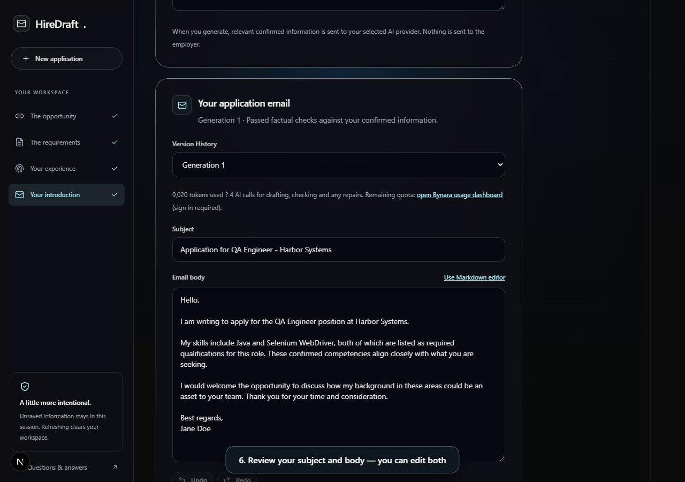

# ✉️ HireDraft

**From job description to your first draft.**

HireDraft turns a job opportunity and your resume into an application email you can review, edit, and export. A four-step workspace brings together job requirements, your experience, and writing preferences.

Built with **Next.js 16 · React 19 · Tailwind CSS 4 · Motion**.

[🎬 Watch the demo](public/demo/hiredraft-live-demo.webm) · [🚀 Run locally](#-run-locally) · [🧭 Explore the workflow](#-the-four-step-workflow) · [🛠️ Development](#-development)

## 🎬 See the real workflow

[](public/demo/hiredraft-live-demo.webm)

**Click the image to open the 73-second product demo.** In the running app, select **Watch the real demo** on the homepage.

The recording uses a fictional job and sample resume, with an email generated live by Bynara through the actual workspace. It shows job entry, requirements review, resume upload, profile confirmation, email generation, and saving the draft. Processing time is included; results and timing vary.

- ▶️ Playback controls and inline mobile playback.
- 💬 English captions and on-screen instructions; no audio is required.
- 🖼️ Updated poster showing the generated email.
- 📖 Expandable written walkthrough and a video download fallback.
- 📱 Responsive player with a direct link to try the workspace.

| Demo asset       | File                                                                         |
| ---------------- | ---------------------------------------------------------------------------- |
| Recording        | [hiredraft-live-demo.webm](public/demo/hiredraft-live-demo.webm)             |
| Poster           | [hiredraft-live-demo-poster.png](public/demo/hiredraft-live-demo-poster.png) |
| English captions | [hiredraft-live-demo.vtt](public/demo/hiredraft-live-demo.vtt)               |
| Chapter timings  | [chapters.json](public/demo/chapters.json)                                   |

## ✨ Latest updates

| Area                   | What changed                                                                                                                                   |
| ---------------------- | ---------------------------------------------------------------------------------------------------------------------------------------------- |
| 🎥 Homepage demo       | Replaced the illustrative-response walkthrough with a real, approximately 73-second recording of the application workflow.                     |
| 🧭 Simpler workflow    | Profile confirmation leads directly to email generation. Experience matching happens within the workflow, without a separate alignment screen. |
| ✍️ Drafting experience | Generated text appears with a typing effect, with an instant reveal for reduced-motion preferences.                                            |
| 🔄 Draft revisions     | Switch between Generation 1–3, preserve edits, and refine drafts with feedback or quick suggestions.                                           |
| 📝 Markdown editor     | Write, Preview, and Split views with formatting icons, undo/redo, shortcuts, and word counts.                                                  |
| 📤 Export options      | Copy the subject or body, download text, Word, or Markdown, and open a Gmail compose window.                                                   |
| 🗂️ Saved History       | Save up to 30 email snapshots in the current browser and reopen or delete them later.                                                          |
| 💡 Status feedback     | Document-scan loading animations, generation progress, and dismissible notifications for copy, export, and history actions.                    |
| 🎨 Landing page        | Responsive dark styling, animated sections, three switchable application examples, supported-source guidance, FAQs, and informational pages.   |

## 🧭 The four-step workflow

| Step                        | What you do                                                                                                                    | What you review                                                                      |
| --------------------------- | ------------------------------------------------------------------------------------------------------------------------------ | ------------------------------------------------------------------------------------ |
| 🔗 **1. The opportunity**   | Paste a public LinkedIn job or hiring-post URL, or enter the details manually. Select a role when a post contains several.     | Job title, company, and source details.                                              |
| 🔎 **2. The requirements**  | Review the extracted requirements and make corrections where needed.                                                           | Skills, responsibilities, experience expectations, and supporting source text.       |
| 📄 **3. Your experience**   | Upload a PDF or DOCX smaller than 5 MB, or enter candidate information manually. Add optional context and writing preferences. | Identity, employment, projects, skills, education, certifications, and achievements. |
| ✉️ **4. Your introduction** | Choose an available provider, tone, and length, then generate your email.                                                      | The subject and body, which you can edit, revise, copy, export, or save.             |

Changing an earlier step clears dependent results so the draft reflects the latest confirmed information. Starting a new application or refreshing clears the unsaved workspace; explicitly saved emails remain in **Saved History** until deleted or browser site data is cleared.

Gmail opens a compose window for your final review. Add the recipient and any attachments, then send the message yourself.

## ✍️ Draft, refine, and export

### Writing controls

- **Tone:** Professional, Concise, or Confident.
- **Length:** Standard or Short.
- **Context:** Optional application details, writing preferences, and a previous email to guide the style.
- **Revisions:** One initial successful generation and up to two successful regenerations per application session. Failed attempts do not use a regeneration.
- **Feedback:** Add your own instructions or choose **More metrics**, **Shorter**, or **Stronger opening**. Metrics must come from the confirmed experience.
- **Version history:** Switch between generated versions while preserving manual edits.
- **Usage display:** See reported token usage and the number of generation calls when available.

The provider selector includes **Bynara**, **APInex**, and **Ollama · local test**. Actual availability depends on the running installation and the selected service.

### Markdown editing

Select **Use Markdown editor** to switch between **Write**, **Preview**, and **Split** views. The toolbar includes bold, italic, headings, numbered and bulleted lists, links, quotes, inline code, and undo/redo. The editor supports keyboard shortcuts, word counts, and a 10,000-character body limit.

The preview supports GitHub-flavored Markdown, including tables and task lists. Saved drafts retain their body format.

| Action                   | Result                                                                              |
| ------------------------ | ----------------------------------------------------------------------------------- |
| Copy subject / Copy body | Copy the current subject or readable email text.                                    |
| Copy as Markdown         | Copy the Markdown source for use in another editor.                                 |
| Download as `.txt`       | Export readable plain text.                                                         |
| Download as `.docx`      | Export a Word document with basic formatting and links; tables appear as text rows. |
| Download as `.md`        | Keep Markdown formatting in a file.                                                 |
| Open in Gmail            | Open a compose window with the current subject and body.                            |
| Save to History          | Keep a snapshot of the current edited draft in this browser.                        |

## 🎨 Pages and interface

The homepage includes the product demo, three fictional application examples with their job requirements and resume evidence, workflow cards, feature descriptions, supported sources, and FAQs.

Public LinkedIn links support extraction. Content from other sources can be entered manually. The interface includes responsive layouts, keyboard focus states, accessible labels, and reduced-motion support.

| Page                  | Route          |
| --------------------- | -------------- |
| Homepage              | `/`            |
| Application workspace | `/analyze-job` |
| About                 | `/about`       |
| Contact               | `/contact`     |
| Terms                 | `/terms`       |
| Privacy               | `/privacy`     |

## 🚀 Run locally

Requires **Node.js 22.13 or newer** and npm.

```sh
npm install
npm run dev
```

Open [the homepage](http://localhost:3000) or [the application workspace](http://localhost:3000/analyze-job).

To run a production build:

```sh
npm run build
npm start
```

On Windows PowerShell, use `npm.cmd` if the `npm` command is unavailable.

## 🛠️ Development

### Project structure

```text
app/                   Pages, layouts, styles, and route handlers
components/            Homepage, workspace, editors, exports, and history UI
src/                   Job parsing, requirements, profiles, and matching logic
src/server/            Job extraction, resume reading, and email generation
public/demo/           Homepage recording, poster, captions, and chapter timings
scripts/               Demo recording and development utilities
tests/                Domain and application regression tests
tests/legacy/         Original interface fixtures for regression coverage
e2e/                   Playwright browser tests and sample fixtures
llm-gateway/           Local model integration
docs/                  Archived project notes
```

The app uses the Next.js App Router, React state, and shared JavaScript modules, with TypeScript used in parts of the interface. PDF.js handles PDF reading, and `docx` supports Word exports.

### Useful commands

| Command             | Purpose                                             |
| ------------------- | --------------------------------------------------- |
| `npm run dev`       | Start the development server.                       |
| `npm run build`     | Create a production build.                          |
| `npm start`         | Serve the production build.                         |
| `npm run typecheck` | Check TypeScript without emitting files.            |
| `npm test`          | Run the regression suite.                           |
| `npm run test:e2e`  | Run browser tests against the production build.     |
| `npm run format`    | Format the configured source directories and files. |

Browser tests use installed **Google Chrome** and start the production build on port **3100**. Build the app before running them. The tests use sample job and generation responses; the homepage demo recorder uses live generation.

### Record an updated demo

The recorder in [scripts/record-product-demo.mjs](scripts/record-product-demo.mjs) drives the real interface, uploads the sample resume, generates an email, and saves the result through the workspace.

With the app running and a working provider available, run these commands in PowerShell:

```powershell
$env:DEMO_BASE_URL = 'http://localhost:3000'
$env:DEMO_PROVIDER = 'bynara'
node scripts/record-product-demo.mjs
```

The script stages the recording, poster, captions, and chapter timings in `test-results/demo-recording/publish/`. A failed generation does not replace the homepage video. Review playback and caption timing, then copy the reviewed assets into `public/demo/` to update the homepage.

### Latest demo verification

The September 24, 2026 demo update was checked for:

- Successful live email generation through Bynara and saving through the workspace.
- Homepage playback: **72.8 seconds**, **1280 × 900**, and **9 caption cues**.
- Mobile layout at **390 px** wide with no horizontal overflow.
- Passing TypeScript checks and recorder syntax validation.

Use a Node.js-capable Next.js host when deploying; the application requires server-side processing for extraction, resume reading, and generation.
