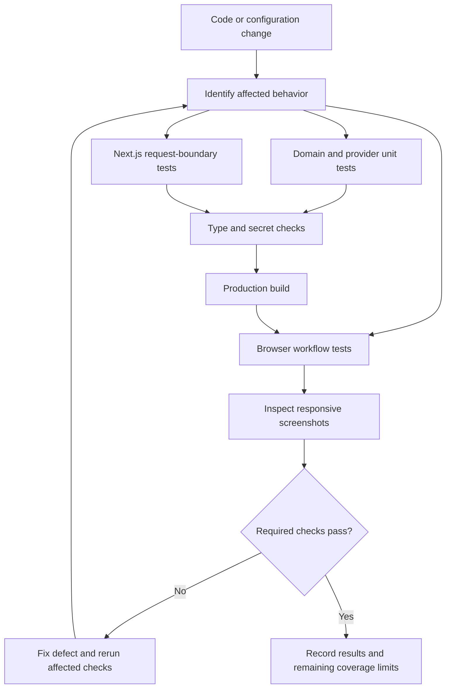
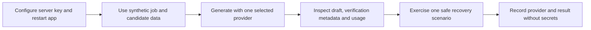

# Testing Guide

**Project:** HireDraft

**Baseline:** 3 October 2026

## 1. Test strategy



The Node regression suite covers domain logic, provider boundaries, Next.js handlers and legacy interface fixtures. Playwright covers the actual Next.js UI. The optional Python suite covers the local gateway. Mocked provider tests validate behavior without confirming a live provider's account status or output quality.

## 2. Prerequisites

- Node.js **22.13 or newer**, npm, and dependencies installed from the lockfile.
- Installed **Google Chrome** for the current Playwright `channel: "chrome"` configuration.
- Port **3100** available for the E2E production server.
- Optional: the configured Python environment under `llm-gateway/.venv` for gateway tests.

```sh
npm ci
```

In Windows PowerShell, use `npm.cmd` and `npx.cmd` if execution policy prevents the corresponding commands. Fixture-based browser tests intercept provider responses and do not require real cloud credentials. Live integration checks do require the server variables documented in [TRD.md](TRD.md).

## 3. Standard checks

Run commands from the repository root:

```sh
npm run typecheck
npm test
npm run check:secrets
npm run build
npm run test:e2e
```

| Command                 | What it establishes                                                                    |
| ----------------------- | -------------------------------------------------------------------------------------- |
| `npm run typecheck`     | TypeScript consistency without emitting output.                                        |
| `npm test`              | Node tests in `tests/*.test.js`.                                                       |
| `npm run check:secrets` | The repository's configured secret-pattern check; it is not a complete security audit. |
| `npm run build`         | Production compilation, type checking and route generation.                            |
| `npm run test:e2e`      | Chrome UI behavior against the production build.                                       |

Build before E2E tests; otherwise they may exercise stale production output. Playwright starts `npm run start -- --hostname 127.0.0.1 --port 3100`. Outside CI it can reuse an existing server, so confirm that any process already serving port 3100 belongs to this checkout and build. Do not stop an unrelated process to make a test pass.

## 4. Targeted test map

| Behavior                                                           | Test files                                                                                                               |
| ------------------------------------------------------------------ | ------------------------------------------------------------------------------------------------------------------------ |
| URL allowlisting and validation                                    | [tests/validate-job-url.test.js](tests/validate-job-url.test.js)                                                         |
| Job and hiring-post extraction                                     | [tests/extraction.test.js](tests/extraction.test.js), [tests/post.test.js](tests/post.test.js)                           |
| Requirements and corrections                                       | [tests/requirements.test.js](tests/requirements.test.js), [tests/requirements-ui.test.js](tests/requirements-ui.test.js) |
| Candidate profiles and file reading                                | [tests/candidate.test.js](tests/candidate.test.js), [tests/resume.test.js](tests/resume.test.js)                         |
| Matching and evidence                                              | [tests/relevance.test.js](tests/relevance.test.js), [tests/relevance-ui.test.js](tests/relevance-ui.test.js)             |
| Provider protocol, verification and safe failures                  | [tests/gateway-providers.test.js](tests/gateway-providers.test.js), [tests/email.test.js](tests/email.test.js)           |
| Export formats                                                     | [tests/email-exports.test.js](tests/email-exports.test.js)                                                               |
| Current API request boundary                                       | [tests/next-api.test.js](tests/next-api.test.js)                                                                         |
| Legacy regression harness                                          | [tests/legacy/README.md](tests/legacy/README.md), [tests/api.test.js](tests/api.test.js)                                 |
| Landing, examples and FAQ                                          | [e2e/landing.spec.js](e2e/landing.spec.js)                                                                               |
| Navigation and menu keyboard behavior                              | [e2e/navigation.spec.js](e2e/navigation.spec.js)                                                                         |
| Themes and font loading                                            | [e2e/theme.spec.js](e2e/theme.spec.js)                                                                                   |
| Responsive public-page matrix                                      | [e2e/responsive.spec.js](e2e/responsive.spec.js)                                                                         |
| Full workflow, uploads, cancellation, editing, exports and history | [e2e/workspace.spec.js](e2e/workspace.spec.js)                                                                           |

Examples:

```sh
node --test tests/gateway-providers.test.js tests/next-api.test.js
npm run test:e2e -- e2e/responsive.spec.js e2e/navigation.spec.js e2e/theme.spec.js
npm run test:e2e -- e2e/workspace.spec.js --grep "all workspace steps"
```

The pre-migration controllers under `tests/legacy/` are not imported or served by Next.js. Passing their tests does not replace testing the current React UI.

## 5. Responsive and visual checks

| Matrix                      | Widths                                 | Coverage                                                                                                        |
| --------------------------- | -------------------------------------- | --------------------------------------------------------------------------------------------------------------- |
| Public pages in both themes | 320, 390, 640, 768, 1024, 1280, 1440px | Homepage, workspace entry, About, Contact, Privacy, Terms and 404; font readiness, overflow and runtime errors. |
| Populated workspace         | 320, 390, 768, 1024, 1440px            | Four steps, draft, Markdown with a table/long URL, and save controls.                                           |
| Navigation                  | Desktop plus mobile widths             | Menu opening, keyboard focus, Escape dismissal and link navigation.                                             |

The public-page matrix includes **98 route/theme/width combinations**. The populated workspace inspection includes **35 stage/width combinations**. These are combinations within tests, not separate test counts.

Open the generated PNGs in `test-results/`, including `review-<theme>-home-<width>.png` and `review-workspace-<stage>-<width>.png`. Inspect:

1. Header, mobile menu and workspace step navigation for overlap or clipped labels.
2. Titles, form fields and native selects for readable wrapping and adequate available width.
3. Editor toolbar, preview tables, long links and export actions for usable wrapping or contained scrolling.
4. Theme contrast, focus indicators and toast placement.
5. Tablet transitions around grid/sidebar breakpoints and desktop spacing.

Full-page screenshots are useful for layout continuity; view them at native scale or inspect individual sections for text legibility. Automated document-width assertions cannot prove every nested control is visually correct.

## 6. Manual acceptance scenarios

| Scenario                 | Procedure                                                                                                                        | Expected result                                                                                                  |
| ------------------------ | -------------------------------------------------------------------------------------------------------------------------------- | ---------------------------------------------------------------------------------------------------------------- |
| Manual happy path        | Enter a job description; confirm requirements; enter candidate experience; confirm profile; generate with a configured provider. | Four steps complete in order and a verified draft is shown.                                                      |
| Default provider         | Reach writing preferences with Byanara configured.                                                                               | Byanara AI is initially selected and can generate.                                                               |
| Missing credentials      | Run without the selected provider's key.                                                                                         | Selection is marked unavailable and generation is disabled; no false live-health claim.                          |
| Restricted LinkedIn page | Try a page requiring login or use an extraction-failure fixture.                                                                 | Actionable failure and manual fallback; no fabricated job details.                                               |
| Multiple-role post       | Load a multi-role fixture and choose one role.                                                                                   | Only the selected role reaches confirmation and matching.                                                        |
| Resume validation        | Try an unsupported extension, empty file, mismatched signature and a file exactly 5 MiB.                                         | Rejection before usable profile creation; valid PDF/DOCX below the limit remains accepted.                       |
| Unreadable/scanned PDF   | Upload a document with no readable text.                                                                                         | Clear reading failure or warnings and manual-entry guidance; no OCR claim.                                       |
| Upstream edit            | Generate, then change confirmed job/requirements/candidate input.                                                                | Dependent results and generated versions are invalidated; stale responses do not repopulate them.                |
| Cancel and rapid clicks  | Cancel extraction/reading/generation; click Generate rapidly.                                                                    | Pending work does not overwrite current state; duplicate concurrent generation is prevented.                     |
| Unsupported AI claims    | Use a mocked unsupported draft/audit.                                                                                            | One repair may occur; persistent unsupported output fails verification.                                          |
| Revision allowance       | Complete an initial generation and two regenerations, including a failed attempt.                                                | Failed attempts do not count; a fourth successful generation is blocked by the UI session allowance.             |
| Editing and export       | Edit subject/body; switch Markdown views; use undo/redo; copy and download.                                                      | Outputs reflect current content/format; manual edits are identified as not rechecked.                            |
| Saved history            | Save, reload, reopen and delete; exercise a full history with test data.                                                         | Snapshots persist in the same browser; unsaved workspace does not; full storage is reported.                     |
| Accessibility            | Navigate with keyboard; switch FAQ tabs; dismiss menu; enable reduced motion.                                                    | Focus is visible, controls remain usable, status is understandable, and reveal is immediate with reduced motion. |

Use synthetic resumes and fictional job data. Avoid putting real candidate information in screenshots, traces or committed fixtures.

## 7. Optional local gateway tests

The gateway suite uses a temporary store and mocked Ollama transport. Run from its directory using the already configured environment:

```powershell
cd llm-gateway
.\.venv\Scripts\python.exe -m pytest test_gateway.py
```

It covers authenticated requests, model restrictions, account controls, quotas, usage and structured-output forwarding. For actual gateway setup and live smoke commands, see [llm-gateway/README.md](llm-gateway/README.md). A passing mocked gateway suite does not prove Ollama is running.

## 8. Live integration smoke checks

Live checks are separate from the automated fixture suite and may consume provider credits.



For each intended provider, confirm account access, generate a short synthetic application and verify that the UI receives a checked draft. Where relevant, complete Bynara's Telegram-link requirement or start the authenticated Ollama gateway. Confirm that unavailable providers and rate/account errors produce safe instructions. Do not infer live readiness solely from `/api/ai-providers`: that endpoint checks key presence.

## 9. Failure diagnosis and artifacts

| Symptom                                         | First checks                                                                                                                   |
| ----------------------------------------------- | ------------------------------------------------------------------------------------------------------------------------------ |
| Browser cannot launch                           | Google Chrome installed and accessible; configuration uses the Chrome channel.                                                 |
| E2E server fails to start                       | Production build exists; port 3100 is free or intentionally reused; Node version is supported.                                 |
| Tests show old UI                               | Rebuild `.next` and verify the server belongs to the current checkout.                                                         |
| Provider unavailable                            | Server variable populated, app restarted and account/gateway accessible; do not print the key.                                 |
| Resume works locally but fails after deployment | Node worker-thread support and traced PDF.js/worker files in `next.config.mjs`.                                                |
| Factual verification fails                      | Inspect synthetic fixture claims, confirmed profiles and mocked audit shape; do not weaken checks to accept unsupported facts. |
| Only a visual test fails                        | Inspect screenshot at the failing width/theme and identify the overflowing element before modifying CSS.                       |

Playwright retains traces for failing tests. Open a trace using its actual generated path:

```sh
npx playwright show-trace test-results/<failing-test-directory>/trace.zip
```

Screenshots and traces are local ignored artifacts. Playwright can clear its output directory at the start of a run; copy evidence elsewhere before another run if it must be retained. Avoid simultaneous runs sharing that output directory.

## 10. Baseline results and release gate

The 3 October 2026 responsive review recorded a successful production build and **25 passing Chrome browser tests**, including the responsive matrix. No responsiveness fixes were required. This documents a historical run, not a guarantee that later changes pass.

The final release review on the same date also passed type checking, **257 Node regression tests**, **20 Python gateway tests**, the production build, and all **25 Chrome browser tests** using two workers. An empty HTTP regression fixture was restored and its extraction test passed. The navigation test now waits for hydration and verifies focus before keyboard activation. Secret scans of publishable files and compiled browser assets reported no findings; local credentials and private runtime artifacts remain ignored.

Safari, Firefox and physical-device behavior remain unverified. Live cloud provider readiness and live Ollama quality are not established by fixture tests.

For a code release, require affected regression tests, type checking, secret checks, a fresh production build, relevant E2E tests and screenshot inspection. Record failures and untested areas explicitly. Documentation-only changes require valid local links, consistent code fences/diagrams and factual agreement with the current source rather than a new live provider call.
