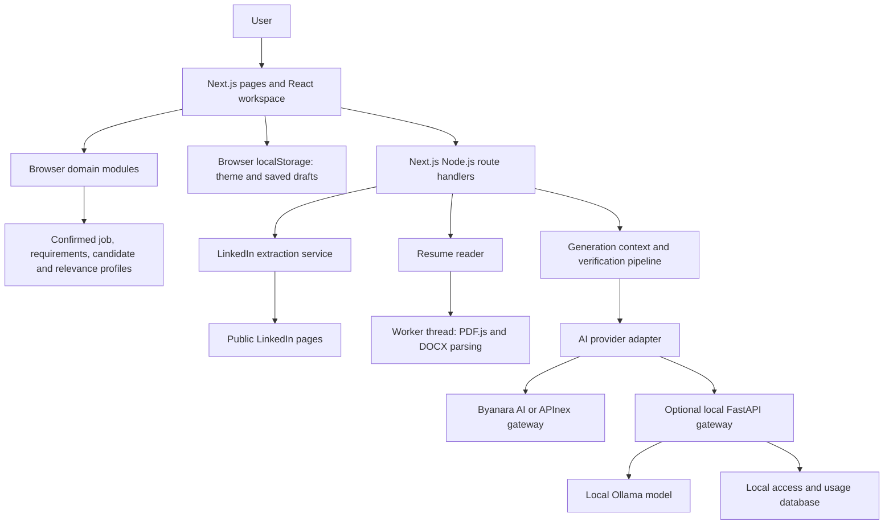
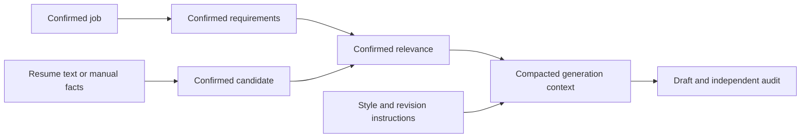

# Technical Requirement Document

**Project:** HireDraft

**Baseline:** Current repository, 3 October 2026

**Status:** Implementation-based specification; future work is identified separately.

## 1. Purpose and scope

HireDraft helps a user prepare a tailored application email from a job opportunity and confirmed candidate information. The user reviews each input, edits the resulting draft, and chooses how to export it. The application does not send messages or submit applications.

The implemented scope includes public LinkedIn job and hiring-post extraction, manual job entry, requirements analysis, PDF/DOCX reading, structured candidate review, experience matching, AI drafting with factual checks, Markdown editing, exports, and browser-local saved history. Accounts, cloud history, OCR, automatic application submission, and extraction from arbitrary websites are outside the current scope.

## 2. Architecture



| Layer             | Technology / responsibility                                                           | Main source                                                                                |
| ----------------- | ------------------------------------------------------------------------------------- | ------------------------------------------------------------------------------------------ |
| Runtime           | Node.js 22.13+, Next.js 16 App Router, React 19                                       | [package.json](package.json), [app/layout.jsx](app/layout.jsx)                             |
| UI                | Tailwind CSS 4, shadcn/ui and Radix controls, MUI-backed icons, Geist font            | [components](components), [app/globals.css](app/globals.css)                               |
| Application state | React state, confirmation gates, cancellation and dependent-result invalidation       | [components/workspace.jsx](components/workspace.jsx)                                       |
| Domain logic      | Normalization, requirements, candidate parsing and deterministic matching             | [src](src)                                                                                 |
| Server            | Extraction, document reading, provider requests and draft verification                | [src/server](src/server), [app/api](app/api)                                               |
| Persistence       | Explicitly saved drafts and theme in the browser; optional gateway access/usage store | [src/email-history.js](src/email-history.js), [llm-gateway/store.py](llm-gateway/store.py) |

The Next.js application has no account database or cloud draft store. The optional gateway database belongs to its access-control service, not to website draft persistence.

## 3. Functional requirements

| ID    | Requirement                                                             | Acceptance condition                                                                                                 |
| ----- | ----------------------------------------------------------------------- | -------------------------------------------------------------------------------------------------------------------- |
| FR-01 | Accept a supported public LinkedIn URL or manually entered job details. | Invalid URLs are rejected; inaccessible links offer manual entry.                                                    |
| FR-02 | Preserve extraction provenance and require review.                      | Partial results and multi-role posts are reviewable; a selected job is confirmed before analysis.                    |
| FR-03 | Derive and review requirements locally.                                 | Technical, professional, employment and application requirements can be corrected before confirmation.               |
| FR-04 | Read a supported resume or accept manual candidate text.                | PDF/DOCX validation occurs before parsing; unreadable documents offer manual entry.                                  |
| FR-05 | Preserve candidate evidence and employment distinctions.                | Reviewed facts retain their origin; internship, full-time and project evidence remain distinguishable.               |
| FR-06 | Match confirmed requirements to confirmed candidate facts.              | Relevant evidence, partial matches and prohibited claims form the generation context.                                |
| FR-07 | Select a configured provider and writing preferences.                   | Byanara AI is initially selected; unavailable selections cannot generate. Tone and length are validated server-side. |
| FR-08 | Generate and check a tailored draft.                                    | Only structurally valid drafts passing known-gap checks and a separate model audit are returned as verified.         |
| FR-09 | Support editing and revisions.                                          | Subject/body editing, Markdown views, version switching and feedback preserve the user's current edits.              |
| FR-10 | Export and explicitly save drafts.                                      | Copy, TXT, DOCX, Markdown and Gmail compose use the current draft; saved history persists across reloads.            |
| FR-11 | Prevent stale responses from changing current state.                    | Cancellation or upstream changes invalidate pending requests and dependent results.                                  |
| FR-12 | Provide a responsive, accessible interface.                             | Navigation, forms and editor work at tested phone/tablet/desktop widths with keyboard and reduced-motion support.    |

## 4. Data contracts and trust boundaries



| Object               | Important contents / invariants                                                                              | Source                                                                                                         |
| -------------------- | ------------------------------------------------------------------------------------------------------------ | -------------------------------------------------------------------------------------------------------------- |
| Job profile          | Source URL/type, title, company, description, recruiter/application details, provenance and confirmation     | [src/job-profile.js](src/job-profile.js)                                                                       |
| Requirements profile | Requirement categories, evidence and snapshot of the confirmed job                                           | [src/requirements-analysis.js](src/requirements-analysis.js), [src/analysis-review.js](src/analysis-review.js) |
| Candidate profile    | Identity, experience, projects, skills, education, certifications, achievements, context and confirmed facts | [src/candidate-profile.js](src/candidate-profile.js)                                                           |
| Relevance profile    | Matches, candidate evidence, gaps, prohibited claims and email grounding context                             | [src/relevance-engine.js](src/relevance-engine.js)                                                             |
| Generated email      | `subject`, `body`, provider/model, timestamp, preferences, usage and validation metadata                     | [src/server/email-generation.js](src/server/email-generation.js)                                               |
| Saved email          | ID, subject, body, plain/Markdown format, timestamp, edited flag and generation number                       | [src/email-history.js](src/email-history.js)                                                                   |

Generation requires all four domain profiles to be confirmed. The server checks the job against the requirements snapshot and rebuilds the confirmed relevance context. These consistency checks are not identity authentication or independent certification of resume truth: user-confirmed facts remain user-supplied facts.

Raw documents, duplicate snapshots and source offsets are removed from the compacted model context. Relevant candidate information still crosses the selected provider boundary. Job content, resume evidence, previous drafts and preferences are treated as untrusted reference data, not system instructions. Style preferences and revision feedback do not establish candidate facts.

## 5. API requirements

All routes below use the Node.js runtime. API responses use `Cache-Control: no-store`.

| Endpoint                   | Input                                                                                                                                                               | Successful result                                                                                                    |
| -------------------------- | ------------------------------------------------------------------------------------------------------------------------------------------------------------------- | -------------------------------------------------------------------------------------------------------------------- |
| `GET /api/ai-providers`    | No body                                                                                                                                                             | `{ providers: [{ id, label, available }] }`; availability means a non-empty configured key, not a live health check. |
| `POST /api/extract-job`    | JSON containing only `url`                                                                                                                                          | Extraction payload with normalized job data and, where applicable, role-selection information.                       |
| `POST /api/read-resume`    | Raw PDF/DOCX bytes; content type and URL-encoded `x-resume-name` header                                                                                             | `text`, `pageCount`, `warnings`, `extractionStatus`, sanitized `file` metadata.                                      |
| `POST /api/generate-email` | JSON: confirmed `job`, `requirements`, `candidate`, `relevance`; `provider`, `tone`, `length`, optional `instruction`, `additionalInformation`, and revision fields | `{ subject, body, metadata }` with `metadata.status = "verified"`.                                                   |

Resume upload is a raw-byte request, not multipart form data. Revision requests use `feedback` and `previousDraft: { subject, body }`. Required application facts absent from profiles are supplied through `additionalInformation`.

Failures have the common shape:

```json
{
  "error": {
    "code": "invalid_request",
    "message": "A safe, actionable explanation."
  }
}
```

Extraction failures also include `job: null`. Known errors preserve their HTTP status; unknown errors return a generic message. Examples include invalid/stale input (400), disallowed origin (403), excessive request size (413), unsupported content (415), failed factual verification (422), invalid model response (502), unavailable provider (503), and generation timeout (504).

## 6. Provider configuration

| Display name                    | Internal ID | Model configured in code | Server variable          |
| ------------------------------- | ----------- | ------------------------ | ------------------------ |
| Byanara AI, selected by default | `bynara`    | `agnes-2.5-flash`        | `BYNARA_API_KEY`         |
| APInex                          | `apinex`    | `gpt/5.6-sol`            | `APINEX_API_KEY`         |
| Ollama · local test             | `ollama`    | `qwen2.5:0.5b`           | `OLLAMA_GATEWAY_API_KEY` |

Provider IDs, models and endpoints come from [src/server/ai-provider.js](src/server/ai-provider.js). Displaying “Byanara AI” does not change the Bynara credential name or internal ID. Keys are used only in server requests and are not returned to the browser. The website does not automatically fall back to another provider. Optional `HIREDRAFT_CONTACT_EMAIL` controls the public support address.

## 7. Limits and failure handling

| Concern             | Current bound / behavior                                                                                                                                            |
| ------------------- | ------------------------------------------------------------------------------------------------------------------------------------------------------------------- |
| Extraction request  | JSON body up to 8,192 bytes; LinkedIn fetch deadline 12 seconds; page body at most 2 MiB.                                                                           |
| Resume upload       | Strictly smaller than 5 MiB; extension, MIME and file signatures checked.                                                                                           |
| Resume worker       | 12-second deadline; 192 MiB old-generation heap limit; PDF maximum 100 pages; extracted text at most 300,000 characters.                                            |
| Generation request  | JSON body up to 1,500,000 bytes; overall generation deadline 225 seconds; route `maxDuration` 240 seconds.                                                          |
| Provider call       | 55 seconds for cloud providers; 125 seconds for local Ollama.                                                                                                       |
| Writing preferences | Instruction at most 1,500 characters; revision feedback at most 1,000 characters.                                                                                   |
| Generated email     | Subject at most 250 characters, without line breaks; body 40–5,000 characters before trimming.                                                                      |
| User-edited body    | Editor/history limit 10,000 characters.                                                                                                                             |
| Revisions           | UI permits one successful generation and two successful regenerations; failed attempts do not count. This is a client workflow limit, not server quota enforcement. |
| Saved history       | Up to 30 unique snapshots; a full history requires deleting an entry.                                                                                               |

Scanned PDFs without readable text have no OCR fallback. Parsing failures do not fabricate content. The generation pipeline permits one repair draft and can repeat an invalid audit response once per attempt; there is no unbounded retry loop. Token totals reflect reported provider usage, with an indicator when reporting is incomplete.

## 8. Security, privacy and deployment

- Validate LinkedIn URL destinations and redirects before fetching; do not expand extraction to arbitrary URLs without equivalent protections.
- Check supplied request origins against the effective host/protocol on mutating routes. Requests without an Origin header are allowed, so this does not authenticate callers.
- Enforce streamed body limits and safe public errors; avoid returning provider credentials or upstream diagnostics.
- Keep resume reading isolated in a bounded worker. Preserve its deployment tracing configuration in [next.config.mjs](next.config.mjs).
- Unsaved workspace state lives in React memory. Theme and explicitly saved email snapshots live in browser storage; clearing site data removes them.
- Deploy on a Node.js-capable Next.js host supporting worker threads and the actual generation duration. The optional Ollama gateway must be reachable from the deployed server; localhost refers to that server's machine.
- Public hosting requires a separately planned authentication, abuse-control and quota design; those controls are not implemented in the Next.js application.

## 9. Quality and verification

The baseline production build and 25 Chrome browser tests passed during the 3 October 2026 responsive review. The page matrix covers 320–1440px in light/dark themes, with additional workspace and editor checks. This is Chrome viewport emulation, not proof of Safari, Firefox or physical-device compatibility, and uses fixture generation responses.

See [TESTING.md](TESTING.md) for reproducible checks, [App_Flow.md](App_Flow.md) for state transitions, and [Implementation_Plan.md](Implementation_Plan.md) for maintenance and proposed next work.
